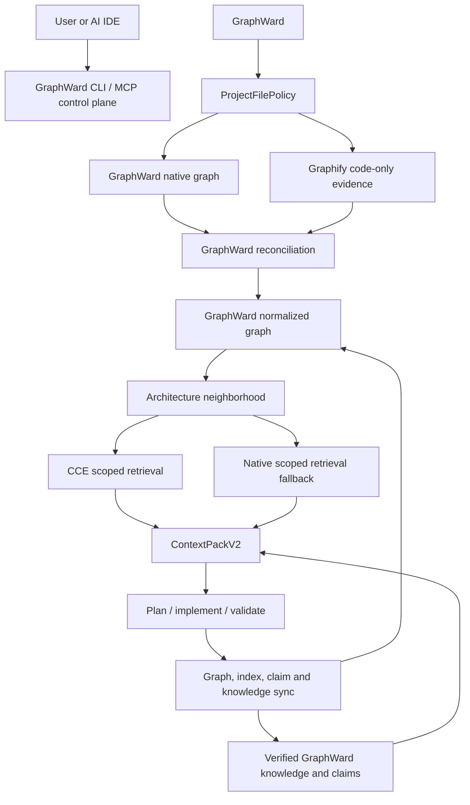

# Architecture Map
<!-- freshness: last_checked=2026-09-03 -->

This summary is derived from EI's normalized dependency graph. Provider JSON/report files are evidence inputs and must not be edited into a competing canonical graph. (evidence: .graphward/graph/dependency-graph.json, src/graph/provider-evidence.ts)

Provider health and fallback status are carried into every task context so degraded operation cannot look fully provider-backed. (evidence: src/context/orchestrator.ts, src/providers/manager.ts)
