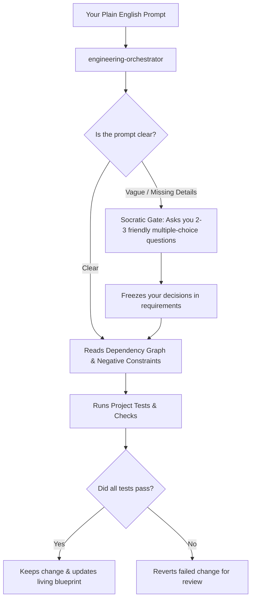

# GraphWard

GraphWard gives AI coding assistants a living blueprint of your codebase so they stop guessing, hallucinating, and breaking working code.

---

## What is GraphWard? (In Simple Terms)

When you ask standard AI to write code, it often guesses how your project works. It might change a button and accidentally break your database, or delete code it didn't understand.

**GraphWard acts like an automated lead architect and project manager:**
1. **Maps your project** — Scans your entire app to understand how every file and function connects.
2. **Clarifies before coding** — If your request is vague, it stops and asks you simple multiple-choice questions instead of guessing.
3. **Runs your project's checks automatically** — Executes your compiler, linter, type-checker, and test suite on every change. If checks fail, the change is reverted so you can review what went wrong. Protection is only as strong as your test coverage.
4. **Remembers past mistakes** — Keeps a record of failed attempts so the AI never repeats the same mistake twice.

---

## Quick Start: 3-Step Process

You do not need to be an engineer to use this. Here is the step-by-step guide:

### Step 1: Initialize Your Project (Run Once)

Open your terminal in your project folder and run:

```bash
npx gw install . --ide <your-editor> --yes
```

Replace `<your-editor>` with your AI IDE:

| Editor | `--ide` value |
|--------|---------------|
| Google Antigravity | `antigravity` |
| Cursor | `cursor` |
| Claude Code | `claude-code` |
| GitHub Copilot | `github-copilot` |
| Gemini CLI | `gemini-cli` |
| Codex | `codex` |
| Command Code | `commandcode` |
| Cline | `cline` |
| Roo Code | `roo-code` |
| Other / Generic | `generic` |

Multiple editors? Pass `--ide` more than once:
```bash
npx gw install . --ide cursor --ide claude-code --yes
```

If you skip `--ide`, GraphWard defaults to generic adapter mode.


This creates a hidden `.graphward/` folder that holds the blueprint, memory, and dependency graphs of your application.

---

### Step 2: Open Your AI Editor

Open your project in any supported AI editor:
- **Google Antigravity**
- **Cursor**
- **Claude Code**
- **GitHub Copilot**
- **Gemini CLI**

In your AI chat window, select or mention the single main coordinator:
```text
@engineering-orchestrator
```
**For most tasks, just describe what you need — the orchestrator routes to the right workflow automatically.**

Power users can also invoke specific workflows directly for granular control:

| Shortcut | What it does |
|----------|-------------|
| `/scope-requirement` | Scope & clarify before implementing |
| `/graphward` | Full implement → test → sync pipeline |
| `/map-architecture` | Rebuild architecture graph |
| `/sync-graphward` | Refresh intelligence after manual edits |

**Typical flow:** scope → implement → review → sync. The orchestrator handles this sequence automatically when you describe what you need.

---

### Step 3: Describe What You Need

Type your request in plain English. For example:

- **To fix a problem:**
  > "The checkout submit button isn't giving any feedback or loading spinner when clicked."
- **To add a feature:**
  > "Add an export-to-PDF button on the customer invoice page."
- **To speed up or improve logic:**
  > "Optimize the order total calculation to handle large baskets faster."

---

## What Happens Automatically When You Prompt It



1. **Clarification Gate**: If your prompt is missing details (e.g., "fix the button"), the AI pauses and presents 2–3 multiple-choice options (which screen? visual ripple or loading spinner?). It will never blindly change code on an assumption.
2. **Context Retrieval**: Pulls in only the exact code needed, plus "Negative Constraints" (patterns that previously failed).
3. **Safe Execution**: Makes the change and tests it. If anything breaks, it rolls back cleanly.
4. **Blueprint Synchronization**: Updates the internal memory and documentation so your project blueprint stays fresh.


---

## Security & Permissions

GraphWard operates entirely on your local machine:

| What GraphWard reads | What GraphWard writes | What GraphWard executes |
|--------------|----------------|------------------|
| Source files in your project | `.graphward/` directory only | Your project's configured check commands (test, lint, typecheck) |
| `package.json`, config files | IDE-specific config (e.g., `.cursor/rules/`) | Nothing else — no network calls, no telemetry |
| Git history (local) | — | — |

> **No telemetry. No cloud sync. No data leaves your machine.** All intelligence artifacts are plain markdown and JSON files you can inspect, edit, or delete at any time.

For full details, see [SECURITY.md](SECURITY.md).

---

## Keeping Intelligence Fresh

When changes go through the GraphWard pipeline (via `@engineering-orchestrator` or `/graphward`), intelligence syncs automatically.

For edits made outside GraphWard — direct IDE edits, git merges, or other tools — you have two options:

1. **Git hooks (recommended):** Install automatic sync hooks during setup:
   ```bash
   npx gw install . --ide <your-editor> --hooks --yes
   ```
   This adds `post-commit` and `post-merge` hooks that incrementally sync affected intelligence artifacts.

2. **Manual sync:** Run when needed:
   ```text
   /sync-graphward
   ```

GraphWard includes staleness detection — it scores artifact freshness and warns when intelligence is stale. But sync is not magic: it requires either the hooks or an explicit command.

---

## Advanced Options & CLI Reference (For Developers)

### Initialization Modes

| Command | Best For |
|---|---|
| `npx gw initialize . --yes` | Default recommended setup with auto-detected providers |
| `npx gw initialize . --providers native --yes` | Offline, zero-download deterministic setup using built-in parser |
| `npx gw initialize . --ide cursor --yes` | Explicitly targets a specific editor adapter |

### Health & Diagnostic Commands

```bash
# Check if your project intelligence is healthy and up-to-date
npx gw health . --strict

# Diagnose installation and tool dependencies
npx gw doctor .

# Run test receipts and verify code safety gates
npx gw verify .

# Fast update of the dependency graph after manual file edits
npx gw sync . --files src/index.ts
```

### What GraphWard Stores in Your Repository

All intelligence lives safely under `.graphward/`:
- `knowledge-base/` — Verified documentation and architecture maps.
- `graph/` — `dependency-graph.json` tracking connections between all modules and symbols.
- `aidlc/` — Project state, requirements, open questions, and backlog tickets.
- `memory/` — Conventions, past decisions, and negative constraints (preventing repeated mistakes).
- `reports/` — Impact and safety audit records.

---

## Why Not Just Use Cursor / Claude Code / Copilot Alone?

**Your intelligence is portable.** GraphWard writes everything to `.graphward/` — a plain directory of markdown and JSON that works across **any** AI IDE. Switch from Cursor to Claude Code to Copilot? Your architecture graph, memory, and project context follow you. No vendor lock-in.

**Supported AI IDEs:** Antigravity, Codex, Claude Code, Cursor, GitHub Copilot, Gemini CLI, Command Code, Cline, Roo Code, and any editor via the generic adapter.

**Cost-aware by design.** Every request gets a dynamic token budget based on task risk — trivial fixes use ~2,000 tokens of context, critical architecture changes scale up to 15,000. No uncapped context loading.

**What the platforms won't do:**
- Carry your project memory across IDE switches
- Give you a portable, version-controlled architecture graph
- Let you inspect and edit every piece of AI context as plain files
- Stay tool-agnostic instead of locking you into one ecosystem

---

## Development

```bash
npm ci
npm test               # Runs all 242 automated test suites
npm run test:integration
npm run build
```

Full technical architecture documentation is available in [WORKFLOW_GUIDE.md](WORKFLOW_GUIDE.md) and [graphward-blueprint.md](graphward-blueprint.md).
