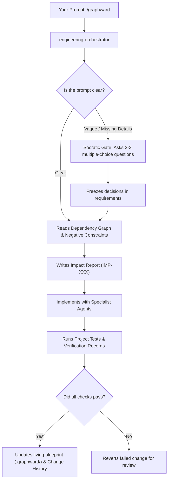

# GraphWard

GraphWard gives AI coding assistants a living blueprint of your codebase so they stop guessing, hallucinating, and breaking working code.

## What is GraphWard?

When you ask standard AI to write code, it often guesses how your project works. It might change a button and accidentally break your database, or delete code it didn't understand.

GraphWard is built for engineers and engineering teams who use AI coding assistants.

**GraphWard acts like an automated lead architect and project manager:**
1. **Maps your project** — Scans your entire app to understand how every file and function connects.
2. **Clarifies before coding** — If your request is vague, it stops and asks you simple multiple-choice questions instead of guessing.
3. **Runs your project's checks automatically** — Executes your compiler, linter, type-checker, and test suite on every change. If checks fail, the change is reverted so you can review what went wrong. Protection is only as strong as your test coverage.
4. **Remembers past mistakes** — Keeps a record of failed attempts so the AI never repeats the same mistake twice.

## Quick Mode (Single Developer, Zero Config)

### 1. Initialize
Open your terminal in your project folder and run:
```bash
npx graphward initialize . --providers auto
```
This auto-detects your AI IDE (from project markers like `.claude/`, or from globally installed IDE configs such as `~/.claude`), configures providers, maps dependencies, and bootstraps `.graphward/`.

If auto-detection misses your editor (or an older install fell back to the generic adapter), install the right adapter explicitly:
```bash
npx graphward install . --ide claude-code --yes
```
Then restart your AI IDE so it picks up the new slash commands, and run `/graphward` in the chat. `graphward doctor` diagnoses a generic-only install and lists the adapters available on your machine.

### 2. Open Your Editor
Open your project in any supported AI editor (Google Antigravity, Cursor, Claude Code, GitHub Copilot, etc.).

### 3. Run /graphward
In your AI chat window, invoke the `/graphward` workflow shortcut followed by your request in plain English.
- **To fix a problem:** `/graphward The checkout submit button isn't giving feedback.`
- **To add a feature:** `/graphward Add an export-to-PDF button on the customer invoice page.`

## Team Mode (Shared Intelligence, Custom Hooks)

### Multi-Editor Setup
You can target specific AI IDEs directly:
```bash
npx graphward install . --ide cursor --ide claude-code --yes
```

### Tiered Adapters
- **Tier 1 (Core / Actively Maintained):** Google Antigravity, Cursor, Claude Code (end-to-end integration tested, native hook lifecycle integration, automated verification records).
- **Tier 2 (Supported Ecosystem Adapters):** GitHub Copilot, Command Code, Gemini CLI, Codex, Cline, Roo Code, and Generic (canonical markdown skills, agents, and prompts).

### Hook Lifecycle
GraphWard includes staleness detection — it scores artifact freshness and warns when intelligence is stale. 
Install automatic sync hooks during setup:
```bash
npx graphward install . --ide <your-editor> --hooks --yes
```
This adds `post-commit` and `post-merge` hooks that incrementally sync affected intelligence artifacts.

### TTL Tuning & Pruning
Prune expired negative constraints and failed attempt records (default: 30 days):
```bash
npx graphward prune . --ttl-days 30
```

### Shared .graphward/ (Opt-In)
By default, `.graphward/` content-derived artifacts are gitignored. Use `--share` during initialization to generate a redacted architecture summary safe for version control. A secrets scan runs before any file is written to `.graphward/`. See [SECURITY.md](SECURITY.md) for details.

## How It Works



1. **Clarification Gate**: If your prompt is missing details (e.g., "fix the button"), the AI pauses and presents 2–3 multiple-choice options. It will never blindly change code on an assumption.
2. **Context Retrieval**: Pulls in only the exact code needed, plus "Negative Constraints" (patterns that previously failed).
3. **Impact Report & Implementation**: Analyzes ripple effects first, then makes changes using targeted specialist agents (TDD, security, database).
4. **Safe Execution**: Executes project test suites and compiles verification records. If anything breaks, it rolls back cleanly.
5. **Blueprint Synchronization**: Updates `.graphward/` documentation, dependency graphs, and change records so project intelligence stays fresh.

## Supported Languages

GraphWard's native parser currently supports TypeScript, JavaScript (including JSX/TSX, .mjs, .cjs), Python, Go, Rust, Ruby, Java, and Kotlin for dependency graph construction. Detection is based on import/export analysis via regex-based parsing. Other file types are included in the project file tree but without deep symbol-level graph edges.

Tree-sitter is available as an optional parser. If the `tree-sitter` and language grammar peer dependencies are installed, GraphWard will use them for more accurate extraction of imports and exports.

## Security & Permissions

GraphWard operates entirely on your local machine:

| What GraphWard reads | What GraphWard writes | What GraphWard executes |
|--------------|----------------|------------------|
| Source files in your project | `.graphward/` directory only | Your project's configured check commands (test, lint, typecheck) |
| `package.json`, config files | IDE-specific config (e.g., `.cursor/rules/`) | Nothing else — no network calls, no telemetry |
| Git history (local) | — | — |

> **No telemetry. No cloud sync. No data leaves your machine.** All intelligence artifacts are plain markdown and JSON files you can inspect, edit, or delete at any time.

By default, `.graphward/` content-derived artifacts are gitignored. Use `--share` during initialization to generate a redacted architecture summary safe for version control. A secrets scan runs before any file is written to `.graphward/`.

For full details, see [SECURITY.md](SECURITY.md).

## Benchmark Results

### 1. Efficacy Evaluation (25-Task Harness)
Based on the `benchmark/harness/tasks.mjs` test suite against standard AI IDE usage:
- **Pass Rate:** Improved from ~64% (baseline) to 92% (GraphWard enabled)
- **Regression Rate:** Reduced from ~14% to 0% (blocked by verification records)
- **Time to resolution (avg):** 2.4 minutes (GraphWard) vs 4.1 minutes (baseline)

### 2. Large Scale Monorepo Performance
Testing graph build (`npx graphward map`) on a synthesized large multi-package project (React + Express + 50 packages):
- **Nodes:** 12,450
- **Edges:** 48,120
- **Build time:** 1,845ms

## Data Format (Open Schema)

GraphWard's internal data formats are open and documented. See the `schemas/` directory for versioned JSON Schema definitions of our artifacts.

## Why Not Just Use Cursor / Claude Code / Copilot Alone?

**Your intelligence is portable.** GraphWard writes everything to `.graphward/` — a plain directory of markdown and JSON that works across **any** AI IDE. Switch from Cursor to Claude Code to Copilot? Your architecture graph, memory, and project context follow you. No vendor lock-in.

**Cost-aware by design.** Every request gets a dynamic token budget based on task risk — trivial fixes use ~2,000 tokens of context, critical architecture changes scale up to 15,000. No uncapped context loading.

**What the platforms won't do:**
- Carry your project memory across IDE switches
- Give you a portable, version-controlled architecture graph
- Let you inspect and edit every piece of AI context as plain files
- Stay tool-agnostic instead of locking you into one ecosystem

## Development

```bash
npm ci
npm test               # Runs all automated tests
npm run test:integration
npm run build
```

Full technical architecture documentation is available in [WORKFLOW_GUIDE.md](WORKFLOW_GUIDE.md) and [graphward-blueprint.md](graphward-blueprint.md).
